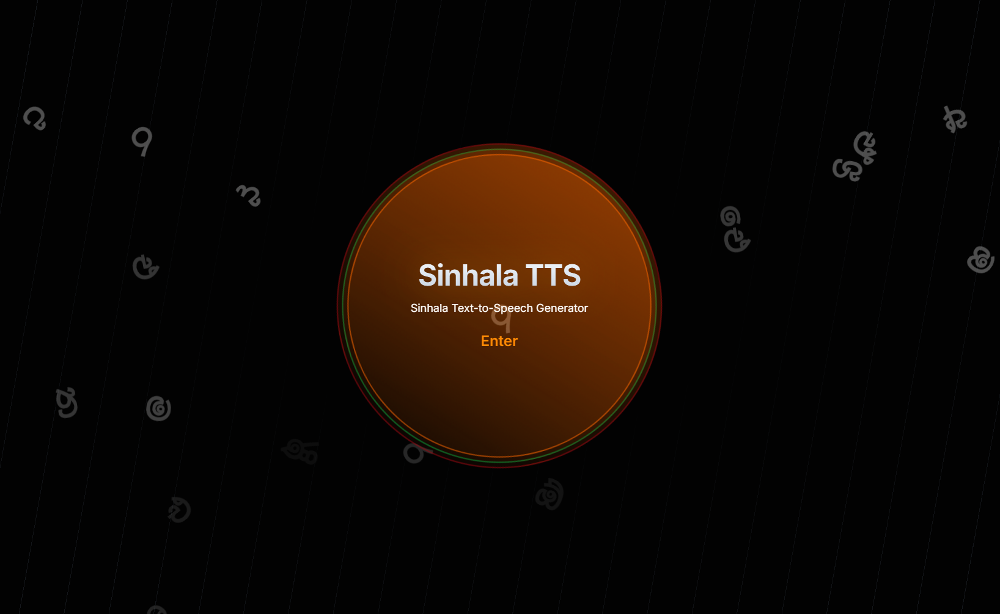
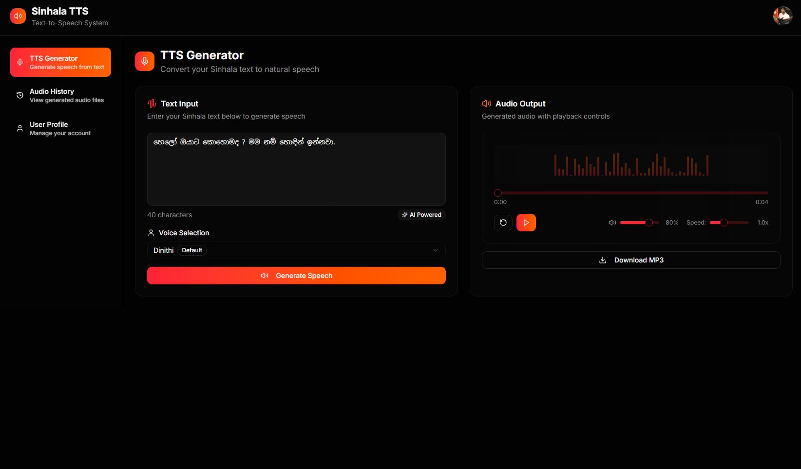
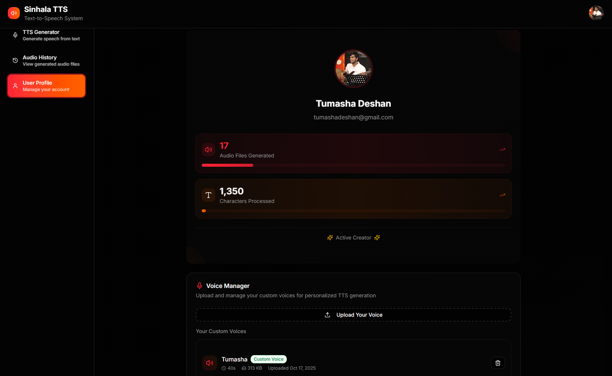
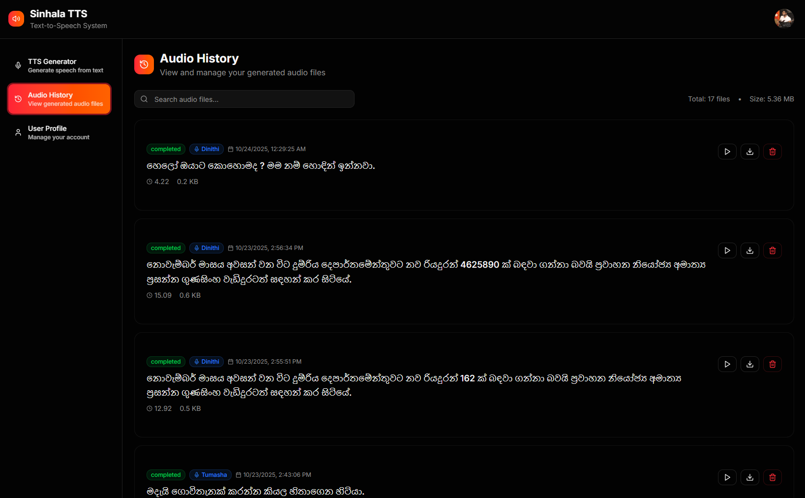

# Sinhala TTS Web Application 🎙️

A modern, AI-powered Text-to-Speech (TTS) system specifically designed for the Sinhala language. This web application combines cutting-edge machine learning with an intuitive user interface to provide high-quality speech synthesis.

## ✨ Features

### 🔊 **Advanced TTS Generation**
- High-quality Sinhala text-to-speech conversion
- Multiple voice options including voice cloning capabilities
- Real-time audio generation with download functionality
- Support for various text lengths and complexities

### 👤 **User Management**
- Secure authentication with Google OAuth integration
- User profiles with usage statistics and analytics
- Personalized voice history and management

### 🎵 **Custom Voice Upload**
- Upload your own voice samples for personalized TTS
- AI-powered voice cloning technology
- Voice management dashboard with preview capabilities

### 📊 **Performance Monitoring**
- Built-in performance testing and benchmarking
- Real-time generation metrics and statistics
- Optimized for RTX 3050 GPU acceleration

## 🖼️ Screenshots

### Landing Page


*Beautiful animated landing page with floating Sinhala letters and Sri Lankan themed design*

&nbsp;

### TTS Generator Interface


*Clean and intuitive interface for text input and speech generation*

&nbsp;

### User Profile Dashboard


*Comprehensive user statistics and achievement tracking*

&nbsp;

### Audio History


*Complete history of generated audio files with search and management*

&nbsp;

## 🚀 Tech Stack

### Frontend
- **Next.js 14** - React framework with App Router
- **TypeScript/JavaScript** - Type-safe development
- **Tailwind CSS** - Utility-first CSS framework
- **Shadcn/ui** - Beautiful component library
- **Framer Motion** - Smooth animations and transitions
- **Lucide React** - Modern icon library

### Backend
- **FastAPI** - High-performance Python web framework
- **PyTorch** - Deep learning framework for TTS models
- **Supabase** - Authentication and database management
- **PostgreSQL** - Reliable data storage

### AI/ML Components
- **Custom TTS Models** - Sinhala-specific speech synthesis
- **Voice Cloning** - RVC (Retrieval-based Voice Conversion)
- **Text Processing** - Sinhala text normalization and G2P conversion

## 🛠️ Installation & Setup

### Prerequisites
- Node.js 18+ and npm/yarn
- Python 3.8+
- CUDA-compatible GPU (recommended)
- Git

### Model Files Setup

**Important**: Before running the application, you need to download the required model files.

1. **Download Model Files**
   ```bash
   # Download the model files from Google Drive
   # Visit: https://drive.google.com/drive/folders/1YZupdQ4HthQ6KLoeQlGkoXH4gjdkLfrK?usp=sharing
   ```

2. **TTS Model Setup**
   ```bash
   # Create models directory in server folder
   mkdir server/models
   
   # Add the following files to server/models/:
   # - dinithi.pth (main TTS model)
   # - dinithi_vocoder.pth (vocoder model)
   ```

3. **Voice Conversion Setup**
   ```bash
   # Create checkpoints directory for voice conversion
   mkdir server/vc/checkpoints
   
   # Add the following files to server/vc/checkpoints/:
   # - vc.pth (voice conversion model)
   # - vc.yml (voice conversion configuration)
   ```

### Frontend Setup

```bash
# Clone the repository
git clone https://github.com/yourusername/sinhala-tts-webapp.git
cd sinhala-tts-webapp/app

# Install dependencies
npm install

# Set up environment variables
cp .env.example .env.local
# Edit .env.local with your Supabase credentials

# Run development server
npm run dev
```

### Backend Setup

```bash
# Navigate to server directory
cd ../server

# Create virtual environment
python -m venv venv
source venv/bin/activate  # On Windows: venv\Scripts\activate

# Install dependencies
pip install -r requirements.txt

# Set up environment variables
cp .env.example .env
# Edit .env with your configuration

# Ensure model files are in place (see Model Files Setup above)

# Run the server
uvicorn main:app --reload --host 0.0.0.0 --port 8000
```

### Environment Variables

#### Frontend (.env.local)
```env
NEXT_PUBLIC_SUPABASE_URL=your_supabase_url
NEXT_PUBLIC_SUPABASE_ANON_KEY=your_supabase_anon_key
```

#### Backend (.env)
```env
SUPABASE_URL=your_supabase_url
SUPABASE_KEY=your_supabase_service_key
DATABASE_URL=your_postgresql_url
```

## 📁 Project Structure

```
sinhala-tts-webapp/
├── app/                          # Next.js frontend
│   ├── src/
│   │   ├── app/                  # App router pages
│   │   ├── components/           # Reusable components
│   │   ├── contexts/             # React contexts
│   │   └── lib/                  # Utilities and configurations
│   └── public/                   # Static assets
├── server/                       # FastAPI backend
│   ├── models/                   # TTS and AI models
│   │   ├── dinithi.pth          # Main TTS model (download required)
│   │   └── dinithi_vocoder.pth  # Vocoder model (download required)
│   ├── vc/                      # Voice conversion
│   │   └── checkpoints/         # Voice conversion models
│   │       ├── vc.pth          # VC model (download required)
│   │       └── vc.yml          # VC config (download required)
│   ├── synthesis.py              # TTS generation logic
│   ├── g2p.py                    # Grapheme-to-phoneme conversion
│   ├── voice_conversion.py       # Voice cloning functionality
│   └── performance.py            # Performance testing
└── screenshots/                  # Application screenshots
```

## ⚠️ Important Notes

### Model Files
- The model files are **required** for the application to function properly
- Download all files from the provided Google Drive link before starting the server
- Ensure proper directory structure as shown above
- Model files are not included in the repository due to their large size

### File Checklist
Before running the server, verify these files exist:
- ✅ `server/models/dinithi.pth`
- ✅ `server/models/dinithi_vocoder.pth`
- ✅ `server/vc/checkpoints/vc.pth`
- ✅ `server/vc/checkpoints/vc.yml`

## 🎯 Usage

1. **Getting Started**: Visit the landing page and click "Enter" to access the application
2. **Guest Mode**: Use the TTS generator without authentication for basic functionality
3. **User Registration**: Sign up to save audio files, upload custom voices, and track usage
4. **Generate Speech**: Enter Sinhala text, select a voice, and generate high-quality audio
5. **Custom Voices**: Upload your voice samples to create personalized TTS models
6. **Manage History**: View, search, and manage all your generated audio files

## 🔧 Performance

The system is optimized for real-time performance with the following benchmarks:

- **Short texts** (< 50 chars): ~0.5-1.0 seconds
- **Medium texts** (50-200 chars): ~1.0-2.5 seconds  
- **Long texts** (200+ chars): ~2.5-5.0 seconds

*Tested on RTX 3050 GPU with CUDA acceleration*

---

<p align="center">Made with ❤️ for the Sinhala speaking community</p>
